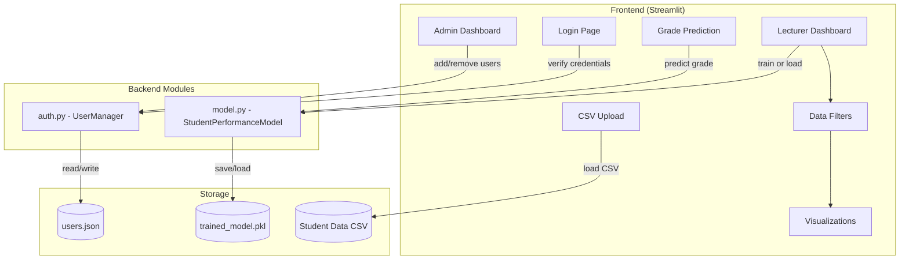
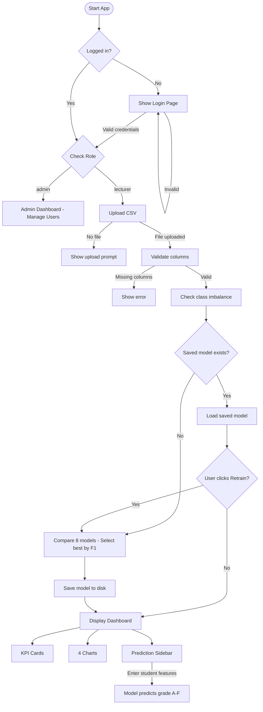
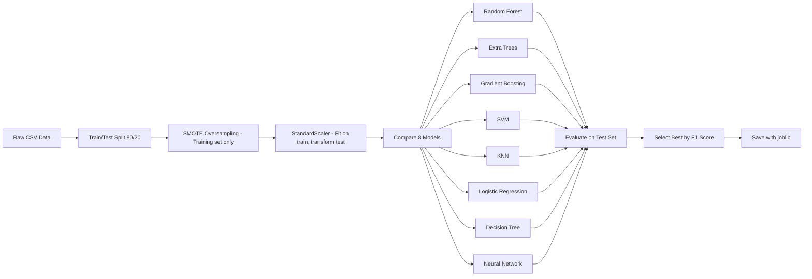

# Student Performance Prediction System
## Workflow & Architecture Documentation

---

## Project Structure

```
StudPerformancePred/
├── app.py                  # Main Streamlit application (UI + routing)
├── model.py                # ML model class (training, comparison, prediction, persistence)
├── auth.py                 # User authentication (hashed passwords, user management)
├── tests.py                # Unit & integration tests (20 tests)
├── model_comparison.py     # Standalone model comparison tool
├── requirements.txt        # Python dependencies
├── .gitignore              # Git ignore rules
├── users.json              # User credentials (hashed)
├── trained_model.pkl       # Saved trained model (auto-generated)
└── Student_performance_data _.csv  # Dataset
```

---

## System Architecture



### Module Responsibilities

| File | Role | Key Classes/Functions |
|------|------|----------------------|
| `app.py` | UI layer — handles routing, display, user interaction | `main()`, `login_page()`, `admin_page()`, `lecturer_page()` |
| `model.py` | ML logic — training, comparison, prediction, save/load | `StudentPerformanceModel` |
| `auth.py` | Authentication — hashed passwords, user CRUD | `UserManager` |
| `tests.py` | Testing — unit tests for auth & model, integration tests | `TestUserManager`, `TestStudentPerformanceModel`, `TestIntegration` |

---

## Application Workflow



### Step-by-Step Workflow

1. **Login** — User enters credentials. Passwords are verified against hashed values in `users.json`.
2. **Role Routing** — Admins see user management. Lecturers see the data dashboard.
3. **CSV Upload** — Lecturer uploads student data. The app validates that all required columns exist.
4. **Imbalance Check** — The app analyzes class distribution and warns if the dataset is imbalanced (ratio > 3x).
5. **Model Loading/Training**:
   - If `trained_model.pkl` exists → loads it instantly (no retraining).
   - If not (or user clicks "Retrain") → compares 8 models, selects the best, saves to disk.
6. **Dashboard** — KPI cards, 4 charts, and a sidebar prediction form.
7. **Prediction** — Lecturer enters student features, model returns predicted grade (A–F).

---

## ML Pipeline



### Key Design Decisions

| Decision | Rationale |
|----------|-----------|
| SMOTE applied **after** train/test split | Prevents data leakage — synthetic samples don't leak into the test set |
| Model selected by **F1 Score** (not accuracy) | F1 is more reliable for imbalanced datasets — balances precision and recall |
| **StandardScaler** used | Many models (SVM, KNN, Logistic Regression, Neural Network) are sensitive to feature scale |
| Model saved with **joblib** | Avoids retraining every session — loads in milliseconds instead of seconds |

### Dataset Imbalance

The dataset is imbalanced (11.3x ratio between largest and smallest class):

| Grade | Count | Percentage |
|-------|-------|------------|
| A     | 107   | 4.5%       |
| B     | 269   | 11.2%      |
| C     | 391   | 16.3%      |
| D     | 414   | 17.3%      |
| F     | 1,211 | 50.6%      |

SMOTE (Synthetic Minority Over-sampling Technique) is used to balance the training data by generating synthetic samples for underrepresented classes.

---

## Authentication Flow

```
User enters credentials
        │
        ▼
UserManager.verify_user()
        │
        ├── Look up username in users.json
        ├── Retrieve stored salt
        ├── Hash input password: SHA-256(salt + password)
        ├── Compare with stored hash
        │
        ▼
    Match? → Return role ("admin" / "lecturer")
    No match? → Return None
```

- Passwords are **never stored in plain text**
- Each user has a unique random **salt** (16 hex characters)
- Existing plain-text passwords are **auto-migrated** to hashed on first load

---

## Features Explained

### Input Features (10)
| Feature | Type | Description |
|---------|------|-------------|
| Age | Integer (15–18) | Student's age |
| Gender | Binary (0/1) | 0 = Male, 1 = Female |
| ParentalEducation | Integer (0–4) | Education level of parents |
| StudyTimeWeekly | Float | Hours studied per week |
| Absences | Integer | Number of absences |
| ParentalSupport | Integer (0–4) | Level of parental support |
| Extracurricular | Binary (0/1) | Participates in extracurricular activities |
| Sports | Binary (0/1) | Participates in sports |
| Music | Binary (0/1) | Participates in music |
| Volunteering | Binary (0/1) | Participates in volunteering |

### Target Variable
| Field | Values | Mapping |
|-------|--------|---------|
| GradeClass | 0–4 | 0=A, 1=B, 2=C, 3=D, 4=F |

---

## How to Run

```bash
# Install dependencies
pip install -r requirements.txt

# Run the app
streamlit run app.py

# Run tests
python -m unittest tests -v
```

Default admin credentials: `admin` / `admin123`
