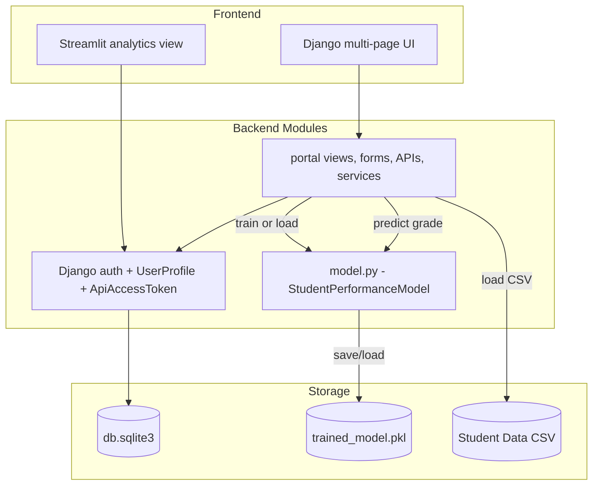
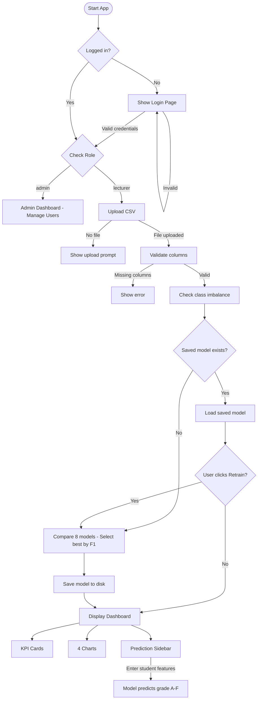
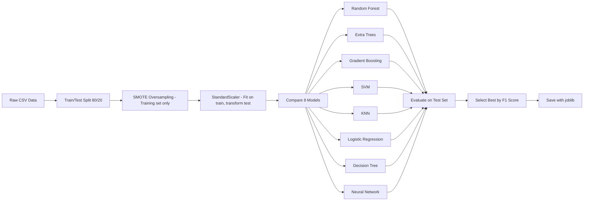

# Student Performance Prediction System
## Workflow & Architecture Documentation

> Note: The repository now includes a Django UI prototype in addition to the original Streamlit app. The Django layer is intended as the next-step migration path for a more maintainable multi-page web interface.

> Update: authentication is now fully database-backed through Django. The old `auth.py` and `users.json` flow is no longer part of the active application path.

---

## Project Structure

```
StudPerformancePred/
├── manage.py                # Django entry point
├── student_portal/          # Django project settings, URLs, ASGI/WSGI
├── portal/                  # Django app (views, routes, services, tests)
├── templates/               # Shared Django templates and page views
├── static/                  # Shared CSS and static assets for Django UI
├── app.py                  # Main Streamlit application (UI + routing)
├── model.py                # ML model class (training, comparison, prediction, persistence)
├── tests.py                # Root ML tests
├── requirements.txt        # Python dependencies
├── .gitignore              # Git ignore rules
├── trained_model.pkl       # Saved trained model (auto-generated)
└── Student_performance_data _.csv  # Dataset
```

---

## System Architecture


```mermaid
graph TB
    subgraph Frontend["Frontend"]
        DJANGO_UI[Django multi-page UI]
        STREAMLIT_UI[Streamlit analytics view]
    end

    subgraph Backend["Backend Modules"]
        DJANGO_AUTH[Django auth + UserProfile + ApiAccessToken]
        MODEL[model.py - StudentPerformanceModel]
        PORTAL[portal views, forms, APIs, services]
    end

    subgraph Storage["Storage"]
        SQLITE[(db.sqlite3)]
        MODEL_PKL[(trained_model.pkl)]
        CSV[(Student Data CSV)]
    end

    DJANGO_UI --> PORTAL
    STREAMLIT_UI --> DJANGO_AUTH
    PORTAL --> DJANGO_AUTH
    DJANGO_AUTH --> SQLITE

    PORTAL -->|load CSV| CSV
    PORTAL -->|train or load| MODEL
    MODEL -->|save/load| MODEL_PKL
    PORTAL -->|predict grade| MODEL
```

### Module Responsibilities

| File | Role | Key Classes/Functions |
|------|------|----------------------|
| `app.py` | Legacy Streamlit UI sharing the Django auth database | `main()`, `login_page()`, `admin_page()`, `lecturer_page()` |
| `model.py` | ML logic — training, comparison, prediction, save/load | `StudentPerformanceModel` |
| `tests.py` | Root ML tests outside Django | `TestStudentPerformanceModel`, `TestModelIntegration` |
| `portal/views.py` | Django page controllers, token management, and JSON API endpoints | `login_view()`, `predict_view()`, `predict_api_view()`, `predict_token_api_view()` |
| `portal/forms.py` | Validation layer for login, prediction, upload, and admin actions | `PortalLoginForm`, `StudentPredictionForm`, `BatchUploadForm`, `AdminUserCreateForm` |
| `portal/models.py` | Role and API token storage | `UserProfile`, `ApiAccessToken` |
| `portal/services.py` | Django data orchestration layer — dataset loading, model bootstrapping, risk scoring, batch prediction | `build_dashboard_context()`, `build_prediction_context()`, `build_batch_context()` |

---

## Django UI Prototype

The Django scaffold adds a multi-page web interface with a reusable layout and bento-style design system.

### Pages Included

1. Login page using Django authentication with database-backed users.
2. Lecturer dashboard with model metrics, charts, and top at-risk students.
3. Single student prediction form with prediction explanations.
4. Batch CSV upload page with validation and prediction preview.
5. Student detail page with current profile signals and interventions.
6. Admin console for user management and model snapshot viewing.

### Current Position

- The original Streamlit app still exists and can still be used.
- The Django UI is the recommended migration path for a more maintainable final-year-project or portfolio version.
- Django now uses built-in authentication, Django forms, and SQLite-backed users.
- Prediction and batch workflows now expose JSON API endpoints in addition to page views.
- Secure API routes now support Bearer-token authentication for future mobile or external frontend clients.
- The Streamlit app now reads the same Django-backed users instead of the retired JSON auth store.

---

## Application Workflow


```mermaid
flowchart TD
    START([Start App]) --> CHECK_LOGIN{Logged in?}
    CHECK_LOGIN -->|No| LOGIN[Show Login Page]
    LOGIN -->|Valid credentials| ROUTE{Check Role}
    LOGIN -->|Invalid| LOGIN

    CHECK_LOGIN -->|Yes| ROUTE
    ROUTE -->|admin| ADMIN_PAGE[Admin Dashboard - Manage Users]
    ROUTE -->|lecturer| UPLOAD[Upload CSV]

    UPLOAD -->|No file| WAIT[Show upload prompt]
    UPLOAD -->|File uploaded| VALIDATE[Validate columns]
    VALIDATE -->|Missing columns| ERROR[Show error]
    VALIDATE -->|Valid| IMBALANCE[Check class imbalance]

    IMBALANCE --> CHECK_MODEL{Saved model exists?}
    CHECK_MODEL -->|Yes| LOAD[Load saved model]
    CHECK_MODEL -->|No| TRAIN

    LOAD --> RETRAIN{User clicks Retrain?}
    RETRAIN -->|No| DASHBOARD
    RETRAIN -->|Yes| TRAIN

    TRAIN[Compare 8 models - Select best by F1] --> SAVE[Save model to disk]
    SAVE --> DASHBOARD

    DASHBOARD[Display Dashboard]
    DASHBOARD --> KPI[KPI Cards]
    DASHBOARD --> VIZ[4 Charts]
    DASHBOARD --> PRED[Prediction Sidebar]

    PRED -->|Enter student features| PREDICT[Model predicts grade A-F]
```

### Step-by-Step Workflow

1. **Login** — User enters credentials. Passwords are verified through Django authentication against the SQLite-backed user database.
2. **Role Routing** — Admins see user management. Lecturers see the data dashboard.
3. **CSV Upload** — Lecturer uploads student data. Django forms validate the file and the app validates that all required columns exist.
4. **Imbalance Check** — The app analyzes class distribution and warns if the dataset is imbalanced (ratio > 3x).
5. **Model Loading/Training**:
   - If `trained_model.pkl` exists → loads it instantly (no retraining).
   - If not (or user clicks "Retrain") → compares 8 models, selects the best, saves to disk.
6. **Dashboard** — KPI cards, 4 charts, and a sidebar prediction form.
7. **Prediction** — Lecturer enters student features, model returns predicted grade (A–F).
8. **API Access** — Logged-in users can issue or revoke a personal API token for secure external clients.

---

## ML Pipeline


```mermaid
flowchart LR
    DATA[Raw CSV Data] --> SPLIT[Train/Test Split 80/20]
    SPLIT --> SMOTE[SMOTE Oversampling - Training set only]
    SMOTE --> SCALE[StandardScaler - Fit on train, transform test]
    SCALE --> COMPARE[Compare 8 Models]

    COMPARE --> RF[Random Forest]
    COMPARE --> ET[Extra Trees]
    COMPARE --> GB[Gradient Boosting]
    COMPARE --> SVM_[SVM]
    COMPARE --> KNN[KNN]
    COMPARE --> LR[Logistic Regression]
    COMPARE --> DT[Decision Tree]
    COMPARE --> NN[Neural Network]

    RF --> EVAL[Evaluate on Test Set]
    ET --> EVAL
    GB --> EVAL
    SVM_ --> EVAL
    KNN --> EVAL
    LR --> EVAL
    DT --> EVAL
    NN --> EVAL

    EVAL --> BEST[Select Best by F1 Score]
    BEST --> SAVE[Save with joblib]
```

### Key Design Decisions

| Decision | Rationale |
|----------|-----------|
| SMOTE applied **after** train/test split | Prevents data leakage — synthetic samples don't leak into the test set |
| Model selected by **F1 Score** (not accuracy) | F1 is more reliable for imbalanced datasets — balances precision and recall |
| **StandardScaler** used | Many models (SVM, KNN, Logistic Regression, Neural Network) are sensitive to feature scale |
| Model saved with **joblib** | Avoids retraining every session — loads in milliseconds instead of seconds |

### Dataset Imbalance

The dataset is imbalanced (11.3x ratio between largest and smallest class):

| Grade | Count | Percentage |
|-------|-------|------------|
| A     | 107   | 4.5%       |
| B     | 269   | 11.2%      |
| C     | 391   | 16.3%      |
| D     | 414   | 17.3%      |
| F     | 1,211 | 50.6%      |

SMOTE (Synthetic Minority Over-sampling Technique) is used to balance the training data by generating synthetic samples for underrepresented classes.

---

## Authentication Flow

```
User enters credentials
        │
        ▼
PortalLoginForm.clean()
        │
    ├── Validate required fields
    ├── Call Django authenticate()
    ├── Read hashed password from Django user table
    ├── Resolve role from UserProfile
        │
        ▼
    Match? → Return role ("admin" / "lecturer")
    No match? → Return None
```

- Passwords are handled by Django's built-in password hashing system
- Roles are stored separately in `portal.models.UserProfile`
- Admin user creation now uses Django forms with stronger validation and password confirmation

### API Authentication

- Session-based JSON endpoints remain protected for in-browser use.
- Secure API endpoints accept `Authorization: Bearer <token>` or `X-API-Token`.
- Tokens are stored as hashes in `portal.models.ApiAccessToken` and can be generated or revoked from the dashboard.

---

## Features Explained

### Input Features (10)
| Feature | Type | Description |
|---------|------|-------------|
| Age | Integer (15–18) | Student's age |
| Gender | Binary (0/1) | 0 = Male, 1 = Female |
| ParentalEducation | Integer (0–4) | Education level of parents |
| StudyTimeWeekly | Float | Hours studied per week |
| Absences | Integer | Number of absences |
| ParentalSupport | Integer (0–4) | Level of parental support |
| Extracurricular | Binary (0/1) | Participates in extracurricular activities |
| Sports | Binary (0/1) | Participates in sports |
| Music | Binary (0/1) | Participates in music |
| Volunteering | Binary (0/1) | Participates in volunteering |

### Target Variable
| Field | Values | Mapping |
|-------|--------|---------|
| GradeClass | 0–4 | 0=A, 1=B, 2=C, 3=D, 4=F |

---

## How to Run

```bash
# Install dependencies
pip install -r requirements.txt

# Run the original Streamlit app
streamlit run app.py

# Run the Django UI prototype
python manage.py runserver

# Run root ML tests
python -m unittest tests -v

# Run Django tests
python manage.py test portal
```

Default admin credentials: `admin` / `admin123`
